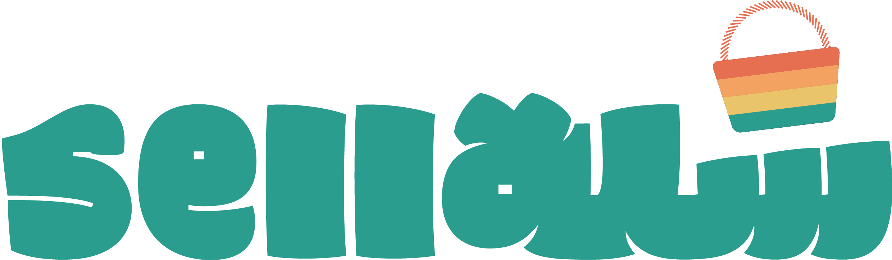

***
# Sella | سلة

### **By:** Ali Fahmi, Sharmeen Mirza, Zahid Balooshi
***
## **Description**
A simple C to C marketplace for the people by the people. Users can browse and view listings
and contact the sellers/listing owners directly through contact information. Users can also
post/list their items to sell. A hub where every **sella’** finds a **buya’**.

***
## **Background**
Sella was built to make buying and selling items easy and local. We wanted a simple platform where people can list their items, browse what others are selling, and connect directly with sellers.
***
### **Link to the site:** [insert link here]

***
## **Functionalities**
🏠 Users can browse the homepage and view all listings without logging in, filter listings by category, and view detailed information for each item.

🔑 Registered users can sign up, sign in, and manage their profiles, including updating personal information.

🛒 Users can add, edit, and delete their own listings, as well as favorite listings and view their favorited items.

👤 Users can explore other sellers’ profiles, leave ratings and feedback, and manage their own comments.

⭐ When navigating to a listing, users can rate and comment on the seller unless they are the owner of the listing.

🚪 Users can sign out when finished.

***
## **Final Product**

**Home Page:**
[Home Page image]

**Profile Page:**
[Insert image]

**Listings Page:**
[Insert image]

**Rate/Feedback Page:**
[Insert image]

***
## **Technologies Used**
- **JavaScript (Node.js)** – Server-side scripting.
- **Express** – Web framework for handling routes and server logic.
- **EJS** – Templating engine for rendering dynamic HTML pages.
- **MongoDB & Mongoose** – Database and object modeling.
- **HTML, CSS, Codepen** – Frontend layout and styling.
- **Bcrypt** – Password hashing for secure authentication.
- **Express-session** – User session management.
- **Multer** – File upload handling (for listing images).
- **Method-override** – Enables PUT and DELETE requests from forms.
- **Morgan** – HTTP request logging.
- **Dotenv** – Environment variable management.
- **Nodemon** – Auto-restarting server during development.
***
## **Next Steps**
- Add real-time chat between buyers and sellers.
- Add admin dashboard for monitoring users and listings.
- Enable multiple images per listing.

***
## **Attributions**
- [Express](https://expressjs.com/) – Web framework used to build the server.
- [EJS](https://ejs.co/) – Templating engine used for rendering HTML pages.
- [Mongoose](https://mongoosejs.com/) – MongoDB object modeling tool.
- [Bcrypt](https://www.npmjs.com/package/bcrypt) – Library used to hash passwords.
- [Express-session](https://www.npmjs.com/package/express-session) – For handling user sessions.
- [Method-override](https://www.npmjs.com/package/method-override) – Allows PUT and DELETE requests in forms.
- [Multer](https://www.npmjs.com/package/multer) – Handles file uploads (images for listings).
- [Morgan](https://www.npmjs.com/package/morgan) – Logging HTTP requests.
- [Dotenv](https://www.npmjs.com/package/dotenv) – Loads environment variables from a `.env` file.
- [Nodemon](https://www.npmjs.com/package/nodemon) – For automatically restarting the server during development.
- GIFs used in the README: [Giphy](https://giphy.com/)
***
## Thank You for Visting!
 

